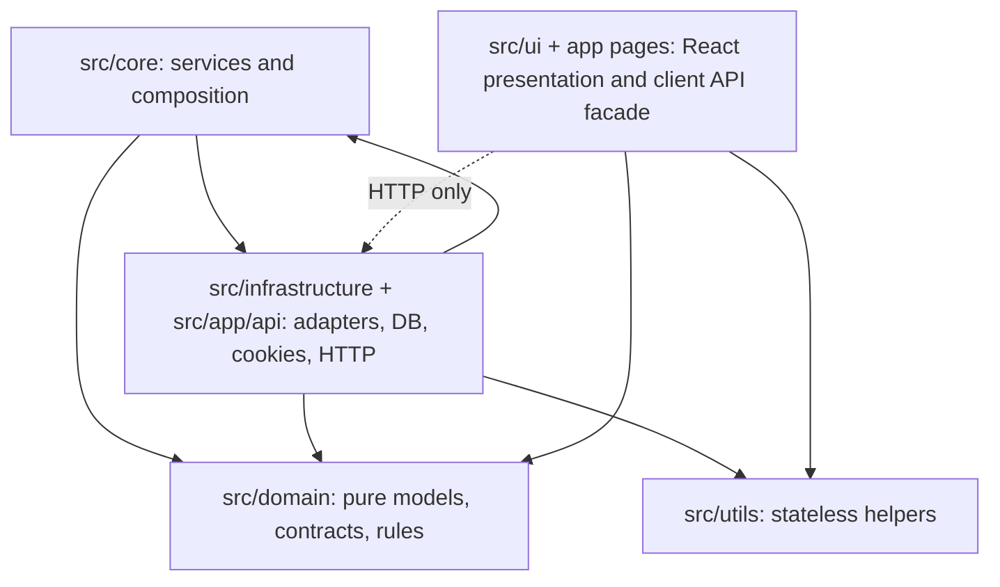

# PlayMoreTCG Knowledge Ledger

Definitive architectural bridge for humans and autonomous agents working in `/Users/bozoegg/Desktop/PlayMoreTCG`.

## Navigation

### Onboarding
- [Getting Started](./onboarding/getting-started.md) — environment requirements, install, first run, verification commands.
- [Walkthrough](./onboarding/walkthrough.md) — guided tour through Domain, Core, Infrastructure, UI, and Plumbing.
- [Troubleshooting](./onboarding/troubleshooting.md) — verified operational pitfalls and recovery commands.

### Architecture
- [Overview](./architecture/overview.md) — Joy-Zoning dependency graph, request/session flow, and structural rationale.
- [Directories](./architecture/directories.md) — top-level directory dictionary with constraints.
- [Schemas](./architecture/schemas.md) — domain models, repository contracts, service interfaces, API guard behavior.
- [Decisions](./architecture/decisions.md) — ADRs protecting architectural intent.
- [Risk Map](./architecture/risk-map.md) — fragile surfaces, blast radius, and mandatory tests.
- [Admin Panel](./architecture/admin-panel.md) — features, merchant operations, and technical implementation.
- [Admin Access](./admin-access.md) — credentials and instructions for local access.

### Agent
- [Agent Memory](./agent/agent-memory.md) — condensed strict constraints for future autonomous agents.
- [Patterns](./agent/patterns.md) — repeatable implementation/audit workflows.

### Ledger
- [Changelog](./changelog.md) — granular forensic citations for verified structural changes.

## Current verified state

- Framework/runtime stack: Next.js `16.0.10` declared in `package.json`, React `19.2.5`, TypeScript `~6.0.2`, ESLint `10.2.1`, Tailwind CSS `4.2.4` with `@tailwindcss/postcss`.
- Runtime scripts from `package.json`: `npm run dev`, `npm run build`, `npm run lint`, `npm run start`.
- Lint baseline stabilization verified in `eslint.config.js`; legacy high-noise rules (`@typescript-eslint/no-unused-vars`, `@typescript-eslint/no-explicit-any`, `react-hooks/exhaustive-deps`, `react-hooks/purity`, and related unused/empty/useless-assignment checks) are temporarily disabled to keep `npm run lint` green while incremental debt cleanup proceeds.
- TypeScript path aliases from `tsconfig.json`: `@domain/*`, `@core/*`, `@infrastructure/*`, `@ui/*`, `@utils/*`.
- Domain layer files verified: `src/domain/models.ts`, `src/domain/repositories.ts`, `src/domain/rules.ts`; these define pure models, repository/service contracts, and business validation without framework or filesystem imports.
- Settings typing hardening verified: `src/core/SettingsService.ts` now uses Domain `JsonValue` for settings reads/writes, and `src/infrastructure/repositories/sqlite/SQLiteSettingsRepository.ts` now persists and returns `JsonValue`-typed records instead of `any`.
- Core composition verified in `src/core/container.ts`; it orchestrates services and wires Infrastructure adapters through lazy singleton/factory creation.
- Core composition now wires `SovereignLocker` into `OrderService` for SQLite-backed checkout mutual exclusion and conditionally wires `TrustedCheckoutGateway` when `CHECKOUT_ENDPOINT` is configured.
- Stripe payment adapter hardening verified in `src/infrastructure/services/StripePaymentProcessor.ts`; it now performs real Stripe PaymentIntent create+confirm requests, requires `STRIPE_SECRET_KEY`, propagates idempotency keys to Stripe, validates response shape, and maps non-success states/network failures to controlled `PaymentFailedError` messages.
- Seed pipeline hardening verified in `src/infrastructure/services/SeedDataLoader.ts`; production seeding now requires explicit `ALLOW_PRODUCTION_SEEDING=true`, order seeding no longer uses `as any` service internals, and seeded order writes flow through explicit Infrastructure repository access with shape-aligned payloads.
- Infrastructure server bridge verified in `src/infrastructure/server/services.ts`; it initializes SQLite through `initDatabase()` once before returning the Core service container.
- Session integrity verified in `src/infrastructure/server/session.ts`; cookies use `pm_tcg_session`, a versioned base64url payload, signed `issuedAt` / `expiresAt`, HMAC-SHA256 signature, timing-safe comparison, production `SESSION_SECRET` length enforcement, server-side expiry rejection, explicit clearing options, and HTTP-only cookie options.
- Session cookies now use centralized cookie options with `sameSite: 'strict'`, and decoded sessions are independently rejected when signed `issuedAt` age exceeds `SESSION_TTL_SECONDS`.
- API boundary hardening verified in `src/infrastructure/server/apiGuards.ts`; routes share session/admin guards, JSON-object parsing, bounded limits, order-status parsing, required-string/integer validation, checkout/cart/product/auth transport parsing, product category/rarity parsing, production-safe unexpected-error responses, and error-to-HTTP mapping.
- Admin settings boundary hardening verified in `src/infrastructure/server/apiGuards.ts` and `src/app/api/admin/settings/route.ts`; setting values must now satisfy a recursive JSON-value guard through `requireJsonValue()` before Core update orchestration.
- Lightweight mutation throttling verified in `src/infrastructure/server/apiGuards.ts`; `assertRateLimit()` maintains bounded in-memory fixed-window buckets keyed by request scope, forwarded/real IP fallback, and user-agent segment.
- Rate-limit response semantics verified in `src/infrastructure/server/apiGuards.ts`; exhausted buckets now throw an expected `RateLimitError`, map to HTTP `429`, and include a `Retry-After` header based on the remaining fixed-window reset time.
- High-risk mutation route throttles verified: `src/app/api/auth/sign-in/route.ts` allows 10 attempts per minute per fingerprint, `src/app/api/auth/sign-up/route.ts` allows 5 attempts per minute, and `src/app/api/orders/route.ts` allows 12 checkout attempts per minute before returning a controlled expected error.
- Additional API boundary hardening verified in `src/infrastructure/server/apiGuards.ts`: JSON request bodies are bounded to `32 * 1024` bytes, JSON content type is enforced when present, cookie-authenticated mutations with an `Origin` header must be same-origin, and checkout idempotency keys must match `/^[a-zA-Z0-9:_-]{16,160}$/`.
- Further mutation-origin hardening verified in `src/infrastructure/server/apiGuards.ts`: `POST` / `PUT` / `PATCH` / `DELETE` requests reject cross-site `Sec-Fetch-Site` values, reject malformed `Origin` values, and require an `Origin` header in production before parsing JSON mutation bodies.
- No-body mutation routes now explicitly apply the same mutation-origin policy: `src/app/api/auth/sign-out/route.ts::POST()`, `src/app/api/cart/route.ts::DELETE()`, and `src/app/api/products/[id]/route.ts::DELETE()` call `assertTrustedMutationOrigin()` even though they do not parse JSON request bodies.
- Order-not-found mapping verified in `src/infrastructure/server/apiGuards.ts`; `OrderNotFoundError` is treated as an expected error and maps to HTTP 404.
- Customer cart/order API identity is session-owned in `src/app/api/cart/route.ts`, `src/app/api/cart/items/route.ts`, and `src/app/api/orders/route.ts`; these routes derive `user.id` from `requireSessionUser()`.
- SQLite cart persistence in `src/infrastructure/repositories/sqlite/SQLiteCartRepository.ts` now flushes `save()` and `clear()` mutations before returning and validates stored cart item JSON shape during hydration.
- SQLite cart flushing now waits for an active flush to finish before returning from write-through paths and maps invalid persisted cart JSON syntax to controlled Domain errors.
- Checkout placement in `src/app/api/orders/route.ts` requires `parseCheckoutRequest()` and a non-empty `paymentMethodId`; no server route now substitutes a missing payment method with `'manual'`.
- Checkout placement in `src/app/api/orders/route.ts` now forwards optional `idempotencyKey` values from the API boundary into `OrderService.placeOrder()`.
- SQLite order hydration in `src/infrastructure/repositories/sqlite/SQLiteOrderRepository.ts` validates stored order item arrays, shipping address JSON, and allowed order status values before returning Domain `Order` models.
- SQLite order hydration maps invalid persisted order item/address JSON syntax to controlled Domain errors.
- SQLite discount hydration hardening verified in `src/infrastructure/repositories/sqlite/SQLiteDiscountRepository.ts`; persisted discount `type`/`status` are validated against Domain unions and invalid persisted values are rejected with controlled `DomainError` messages.
- Core checkout orchestration in `src/core/OrderService.ts` accepts optional idempotency keys for `finalizeTrustedCheckout()` and `placeOrder()` and preserves UUID fallback behavior when no key is supplied.
- Trusted checkout integration in `src/infrastructure/services/TrustedCheckoutGateway.ts` enforces production HTTPS for `CHECKOUT_ENDPOINT`, aborts outbound checkout finalization after `15_000` ms, sends the idempotency key in the `Idempotency-Key` header, and validates the external order response shape before returning a Domain `Order`.
- Trusted checkout integration additionally rejects invalid endpoint URLs, unsupported protocols, embedded endpoint credentials, non-JSON responses, timeout failures, and generic network reachability failures with controlled `PaymentFailedError` messages.
- Cart item mutation parsing in `src/app/api/cart/items/route.ts` is centralized through `parseCartItemMutation()` / `parseProductIdMutation()` rather than route-local string/number coercion.
- Admin/product mutation authorization is session-owned in `src/app/api/admin/orders/route.ts`, `src/app/api/admin/orders/[id]/route.ts`, `src/app/api/products/route.ts`, and `src/app/api/products/[id]/route.ts`; privileged paths require `requireAdminSession()`.
- Admin dashboard summary is now a first-class backend capability: `src/domain/models.ts` defines `AdminDashboardSummary`, `src/core/OrderService.ts::getAdminDashboardSummary()` orchestrates product/order repository data, `src/app/api/admin/dashboard/route.ts` exposes a protected `GET /api/admin/dashboard`, and `src/ui/apiClientServices.ts` provides `orderService.getAdminDashboardSummary()`.
- Admin operating vocabulary now includes pure Domain `InventoryHealth`, `FulfillmentBucket`, `AdminActionItem`, and `InventoryOverview` types in `src/domain/models.ts`, with pure classifiers in `src/domain/rules.ts` for inventory health, fulfillment buckets, and next order action labels.
- Inventory overview orchestration verified in `src/core/ProductService.ts::getInventoryOverview()`; it returns stock health counts, total units, inventory value, and products enriched with inventory health.
- Admin dashboard summary orchestration in `src/core/OrderService.ts::getAdminDashboardSummary()` now includes fulfillment pipeline counts, out-of-stock count, low/out-of-stock watchlist logic, and priority attention items for staff.
- Protected inventory backend route verified at `src/app/api/admin/inventory/route.ts`; `GET /api/admin/inventory` requires `requireAdminSession()` and returns the Core inventory overview through `jsonError()` handling.
- Admin inventory UI verified at `src/ui/pages/admin/AdminInventory.tsx` and `src/app/admin/inventory/page.tsx`; `/admin/inventory` provides stock health filtering, search, plain-language restock action labels, inventory KPI cards, and edit-product links.
- Reusable admin UI library verified in `src/ui/components/admin/AdminComponents.tsx`; it provides `AdminPageHeader`, `AdminMetricCard`, `AdminActionPanel`, `AdminStatusBadge`, and `AdminEmptyState` for consistent, premium merchant experiences.
- Admin shell navigation in `src/ui/layouts/AdminLayout.tsx` now presents a store-manager workflow: Home, Orders, Inventory, Products, uses `usePathname` for active highlighting, and includes a global quick-action button.
- Admin dashboard UI verified in `src/ui/pages/admin/AdminDashboard.tsx`; it renders KPI cards, fulfillment pipeline, priority attention items, and a low-stock watchlist.
- Admin order processing UI verified in `src/ui/pages/admin/AdminOrders.tsx`; it includes status filtering, operator search, cursor next-page controls, expanded fulfillment details with a timeline-style status tracker, and next-status options.
- Admin product form UI in `src/ui/pages/admin/AdminProductForm.tsx` now uses guided merchant copy, a sectioned layout, a sticky customer preview card, and a staff tip panel.
- Formatting/search plumbing verified in `src/utils/formatters.ts`; stateless helpers format USD cents, short dates, status/category labels, and normalized search strings without importing app-specific layers.
- Admin order status validation in `src/app/api/admin/orders/[id]/route.ts` maps missing status to `DomainError` rather than an unexpected raw `Error`.
- Admin order status mutation in `src/core/OrderService.ts` now loads the current order before updating status, returns `OrderNotFoundError` when the target order is absent, and enforces the Domain order status state machine from `src/domain/rules.ts`.
- Domain order lifecycle rules in `src/domain/rules.ts` now define allowed status transitions: `pending -> confirmed | cancelled`, `confirmed -> shipped | cancelled`, `shipped -> delivered`, and terminal `delivered` / `cancelled`; same-status writes are idempotent.
- Domain error taxonomy in `src/domain/errors.ts` now includes `OrderNotFoundError` for order-specific 404 semantics.
- Product create/update transport parsing in `src/app/api/products/route.ts` and `src/app/api/products/[id]/route.ts` uses `parseProductDraft()` / `parseProductUpdate()` before Core product service calls.
- SQLite product hydration in `src/infrastructure/repositories/sqlite/SQLiteProductRepository.ts` validates stored category and rarity strings before returning Domain `Product` models.
- SQLite product and admin order pagination now use composite cursor predicates matching `createdAt desc, id asc` order rather than filtering only by `id > cursor`.
- SQLite product stock mutations in `src/infrastructure/repositories/sqlite/SQLiteProductRepository.ts` now use a stock-value compare-and-swap predicate and verify one row updated, reducing lost-update risk during concurrent stock writers.
- SQLite authentication in `src/infrastructure/services/SQLiteAuthAdapter.ts` no longer reads or writes browser `localStorage`; server session state is owned by signed HTTP-only cookies and UI state remains outside this Infrastructure adapter.
- UI API client verified in `src/ui/apiClientServices.ts`; existing cart/order service signatures still accept `userId`, but `sessionScoped(userId)` discards it and requests no longer transmit it for session-owned endpoints.
- UI API client fetches in `src/ui/apiClientServices.ts` explicitly use `cache: 'no-store'` and `credentials: 'same-origin'` for session-cookie-backed ecommerce API calls.
- UI checkout idempotency propagation verified in `src/ui/pages/CheckoutPage.tsx` and `src/ui/apiClientServices.ts`; checkout finalization creates a stable `checkout-ui:${crypto.randomUUID()}` attempt key, sends it to `/api/orders`, and rotates it only after order confirmation.
- Browser security headers are configured globally in `next.config.ts`: CSP, `X-Content-Type-Options`, `X-Frame-Options`, `Referrer-Policy`, and `Permissions-Policy` with Stripe allowances; production `script-src` omits `'unsafe-inline'` and `'unsafe-eval'` while development keeps them for local Next.js compatibility.
- Additional browser hardening headers are configured globally in `next.config.ts`: `Cross-Origin-Opener-Policy`, `Cross-Origin-Resource-Policy`, `X-DNS-Prefetch-Control`, and production-only `Strict-Transport-Security`.
- ESLint ignores generated output via `eslint.config.js`: `dist`, `.next`, `playmore-tcg/.next`, and `next-env.d.ts`.

## Physical verification commands

Run these from the repository root:

```bash
npm run lint
npm run build
git --no-pager diff --stat
git status --short
```

Latest verification for the seed + Stripe hardening pass: `npm run lint && npm run build` completed successfully, and the production build generated the full current app/api route manifest including `/admin/*`, `/api/admin/*`, `/api/auth/*`, `/api/cart*`, `/api/orders`, and `/api/products*` routes.

## Mermaid: architectural bridge



## Modified documentation files in this synchronization

- [Admin Panel](./architecture/admin-panel.md)
- [Admin Access](./admin-access.md)
- `.wiki/index.md`
- `.wiki/changelog.md`
- `.wiki/onboarding/getting-started.md`
- `.wiki/onboarding/walkthrough.md`
- `.wiki/onboarding/troubleshooting.md`
- `.wiki/architecture/overview.md`
- `.wiki/architecture/directories.md`
- `.wiki/architecture/schemas.md`
- `.wiki/architecture/decisions.md`
- `.wiki/architecture/risk-map.md`
- `.wiki/agent/agent-memory.md`
- `.wiki/agent/patterns.md`
