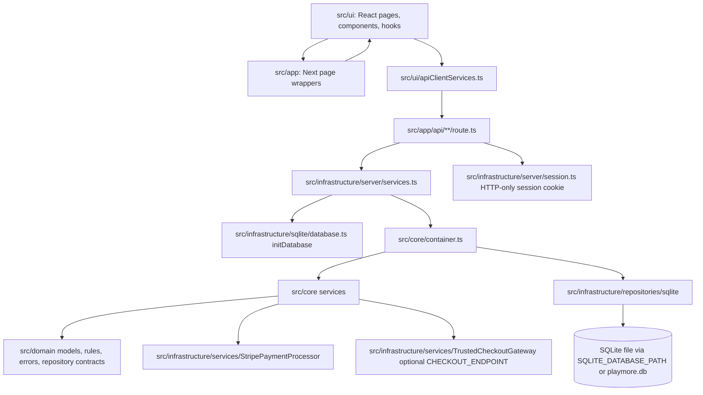
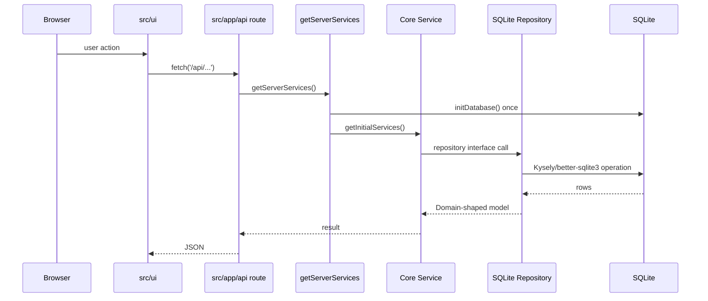

# Architecture

## Verified Stack

PlayMoreTCG is a Next.js App Router ecommerce application using React 19, TypeScript, Tailwind CSS 4, SQLite through `better-sqlite3` + Kysely, bcryptjs auth, and Stripe client packages.

## Layer Map

## Request Flow

## Composition Root

`src/core/container.ts` creates `SQLiteProductRepository`, `SQLiteCartRepository`, `SQLiteOrderRepository`, `SQLiteAuthAdapter`, and `StripePaymentProcessor`. `getInitialServices()` caches singleton repositories/providers for production. `getServiceContainer()` creates fresh instances for tests or isolated debugging.

## High-Density Logic Areas

- `src/core/OrderService.ts`: checkout orchestration, stock checks, locks, payment, rollback/reconciliation behavior.
- `src/domain/rules.ts`: business validations and calculations.
- `src/infrastructure/sqlite/database.ts`: table initialization and SQLite pragmas.
- `src/infrastructure/repositories/sqlite/*`: persistence mapping between SQLite rows and Domain models.
- `src/ui/pages/admin/AdminProductForm.tsx`, cart/products pages: dense UI state and forms.